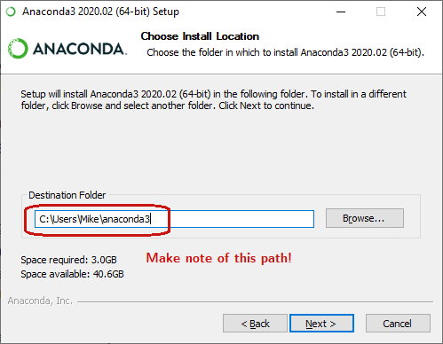

Installing pyforest prerequisites
=================================

Overview
---------------------------------

pyforest is a Stata plugin for decision trees and random forests. It relies on Stata 16's built-in Stata functionality and a few Python libraries. In particular, pyforest requires the popular Python packages scikit-learn and pandas (along with all of their prerequisites).

Installation with Anaconda
---------------------------------

The easiest way to install the Python prerequisites is to install Anaconda. Anaconda is a distribution of Python that includes all of the necessary prerequisites. You can install Anaconda even if you already have one or more Python installations on your computer.

1. Download the most recent verison of Anaconda with Python 3 from [Anaconda's website](https://www.anaconda.com/distribution/#download-section).

2. Follow the directions on the installer. Install for 'Just me' rather than 'All users'. 
   *Write down the install path, as shown in the figure below*. 

3. Close any open Stata windows you might have and open a new one. Type "python query" to see if Stata automatically recognizes your Python installation.

4. If the install path from step (2) is listed in this Stata output, as shown above you're done! Please refer to the built-in documentation for usage examples.

5. If the install path from step (2) is not listed in this Stata output, you must tell Stata where to find your Anaconda installation. 
